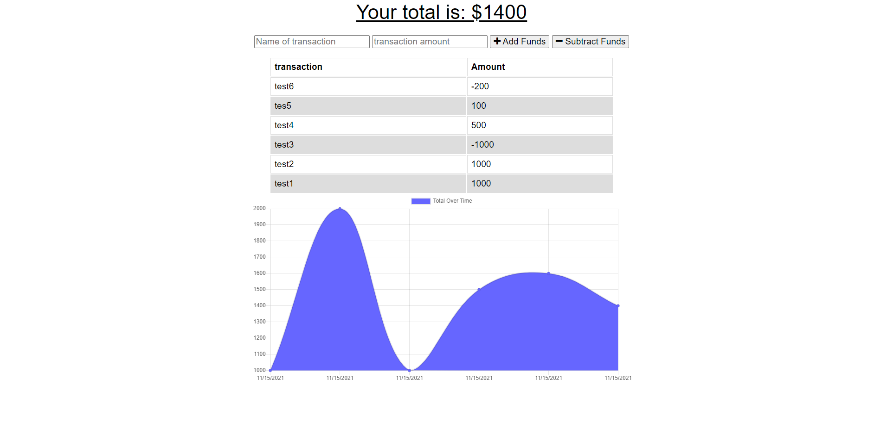

# OfflineBudgetTracker

  
  ## Description
  Budget teracking web app with service worker for offline fuctionality.
  
  ## Table of Contents
  * [Website](#Website)
  * [ScreenShot](#ScreenShot)
  * [Contributing](#Contributing)
  * [License](#license)
  * [Questions](#questions)

  ## Website
   https://floating-eyrie-64563.herokuapp.com/

  
  ## ScreenShot
  
  

  ## Collaborators
  Joe Tremols
  
  ## License
  Licensed under the [MIT License](https://choosealicense.com/licenses/mit/)
  
  ## Contributing
  Anyone is allowed to contribute to this open source project. See the License section for specifics
  
  ## Questions
  For questions please reachout
  GitHub: [NukaGrizz](https://github.com/NukaGrizz)
  Email: nukagrizz@gmail.com